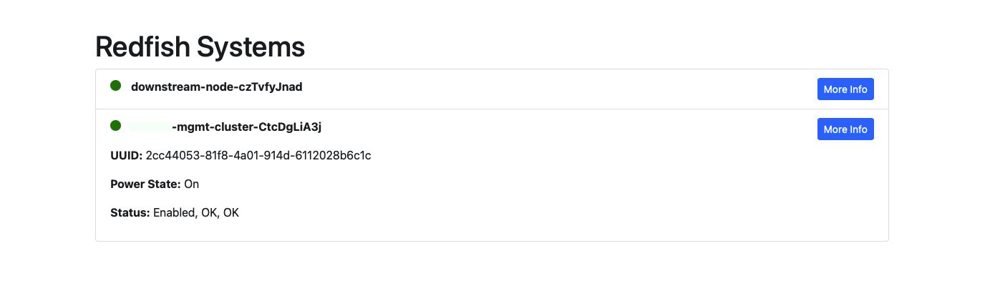

# redfish-ui-parser
It's a Redfish API output parser to have a UI with the results in a graphical way instead of a json. The idea is to show the json output in a more friendly way.

## How to use it

1. Clone the repository

```bash
git clone https://github.com/alknopfler/redfish-ui-parser.git
```

2. Define your URL variable for redfish API

```bash
// This variable could be included in the html template to be defined by the user in the future
var redfishURL = "http://192.168.122.1:8000"
```

3. Build the container
    
```bash
docker build -t redfish-ui-parser .
```

4. Run the container

```bash
docker run -d -p 8081:8081 redfish-ui-parser
```

5. Open your browser and go to http://localhost:8081

6. You will see the json output in a more friendly way

